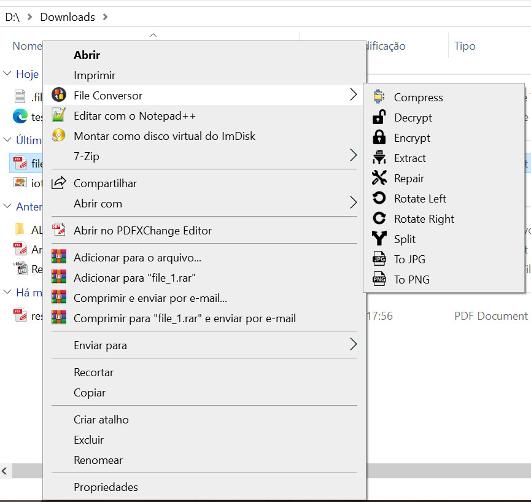

<!-- [](https://www.patreon.com/andre-romano) -->

# File Conversor
A powerful Python-based CLI tool (also planned with GUI support) for converting, compressing, and manipulating audio, video, text, document, and image files.

**Summary**:
- [File Conversor](#file-conversor)
  - [Features](#features)
  - [External dependencies](#external-dependencies)
  - [Installing](#installing)
    - [For Windows](#for-windows)
    - [For Linux / MacOS](#for-linux--macos)
  - [Usage](#usage)
    - [CLI - Command line interface](#cli---command-line-interface)
    - [GUI - Graphical user interface](#gui---graphical-user-interface)
    - [Windows Context Menu (Windows OS only)](#windows-context-menu-windows-os-only)
  - [Why use File Conversor?](#why-use-file-conversor)
  - [Contributing \& Support](#contributing--support)
  - [License and Copyright](#license-and-copyright)

## Features

- **Format Conversion**
  - **Documents**: `docx ⇄ odt`, `docx → pdf`, etc
  - **Spreadsheets**: `xlsx ⇄ ods`, `xlsx → pdf`, etc
  - **Video**: `mkv ⇄ mp4`, `avi ⇄ mp4`, etc.
  - **Images**: `jpg ⇄ png`, `gif ⇄ jpx`, etc.
  - **Audio**: `mp3 ⇄ m4a`, etc.
  - **Text**: `json ⇄ yaml`, `xml ⇄ json`, etc
  - And more ...

- **Compression**  
  - Optimizes size for formats like MP4, MP3, PDF, JPG, and others.

- **Metadata Inspection**  
  - Retrieves EXIF data from images, stream details from audio/video.

- **File Manipulation**  
  - **PDFs**: split, rotate, encrypt, etc  
  - **Images**: rotate, enhance, and apply other transformations  

- **Batch Processing**  
  - Use pipelines and config files for automation and advanced tasks.

- **Multiple Interfaces**  
  - **Windows Explorer integration**: right-click files for quick actions
  - CLI for scripting and automation  
  - GUI (coming soon)  

## External dependencies

This project has external dependencies. 

Prompts will assist you in downloading missing dependencies when required.

## Installing

### For Windows

- **Option 1. Installer (EXE)**:
  - Download the latest version of the app (check [Releases](https://github.com/andre-romano/file_conversor/releases/) pages)
  - Execute installer (.exe file)

- **Option 2. Scoop Package Manager**
```bash
scoop bucket add file_conversor https://github.com/andre-romano/file_conversor
scoop install file_conversor
```

- **Option 3. Choco Package Manager**
```bash
choco install file_conversor -y
```

- **Option 4. PyPi**

```bash
pip install file_conversor
```

### For Linux / MacOS

- **Option 1. PyPi**

```bash
pip install file_conversor
```

## Usage

### CLI - Command line interface

```bash
file_conversor COMMANDS [OPTIONS]
```

Run ``file_conversor -h`` to explore all available commands and options.

### GUI - Graphical user interface

*TODO*

### Windows Context Menu (Windows OS only)

1. Right click a file in Windows Explorer
2. Choose an action from "File Conversor" menu
  


## Why use File Conversor?

- Automate repetitive file conversion or compression tasks
- Manipulate various media formats with a single tool
- Integrate seamlessly with scripting workflows
- Configure advanced file processing pipelines

## Contributing & Support

- **Support us**:
  - If you enjoy this project, consider supporting us with a donation in our Github Sponsors.
- **Acknowledgements**
  - We're grateful to the icon designers whose work is featured in the app: [Freepik](https://www.flaticon.com/authors/freepik), [atomicicon](https://www.flaticon.com/authors/atomicicon), [swifticons](https://www.flaticon.com/authors/swifticons), [iconir](https://www.flaticon.com/authors/iconir), [iconjam](https://www.flaticon.com/authors/iconjam), [muhammad-andy](https://www.flaticon.com/authors/muhammad-andy) (via [Flaticon](https://www.flaticon.com))

## License and Copyright

Distributed under the **Apache License 2.0**.

See [`LICENSE`](./LICENSE) for details.

