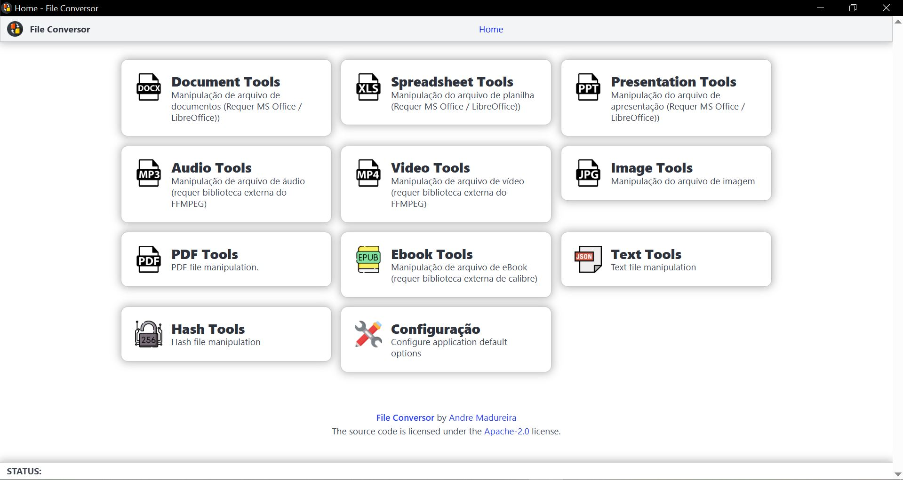

[](https://opensource.org/licenses/Apache-2.0)
[](https://sonarcloud.io/summary/new_code?id=andre-romano_file_conversor)
[](https://sonarcloud.io/summary/new_code?id=andre-romano_file_conversor)
[](https://sonarcloud.io/summary/new_code?id=andre-romano_file_conversor)
[](https://sonarcloud.io/summary/new_code?id=andre-romano_file_conversor)


# File Conversor
A powerful plugin-based CLI and GUI tool for converting, compressing, and manipulating audio, video, text, document, and image files.

**Summary**:
- [File Conversor](#file-conversor)
  - [Usage](#usage)
    - [CLI - Command line interface](#cli---command-line-interface)
    - [GUI - Graphical user interface](#gui---graphical-user-interface)
    - [Windows Context Menu (Windows OS only)](#windows-context-menu-windows-os-only)
  - [Why use File Conversor?](#why-use-file-conversor)
  - [Features](#features)
  - [External dependencies](#external-dependencies)
  - [Installing](#installing)
    - [For Windows](#for-windows)
    - [For Linux / MacOS](#for-linux--macos)
  - [Contributing \& Support](#contributing--support)
  - [License and Copyright](#license-and-copyright)

## Usage

### CLI - Command line interface


Run ``file_conversor -h`` to explore all available commands and options.

### GUI - Graphical user interface



Run ``file_conversor_gui`` to launch the GUI application or double click the Windows Shortcut.

### Windows Context Menu (Windows OS only)

1. Right click a file in Windows Explorer
2. Choose an action from "File Conversor" menu
  


## Why use File Conversor?

- Automate repetitive file conversion or compression tasks
- Manipulate various media formats with a single tool
- Integrate seamlessly with scripting workflows
- Configure advanced file processing pipelines

## Features

- **Format Conversion**
  - **Documents**: `docx ⇄ odt`, `docx → pdf`, etc
  - **Spreadsheets**: `xlsx ⇄ ods`, `xlsx → pdf`, etc
  - **Video**: `mkv ⇄ mp4`, `avi ⇄ mp4`, etc.
  - **Images**: `jpg ⇄ png`, `gif ⇄ webp`, `bmp ⇄ tiff`, etc.
  - **Audio**: `mp3 ⇄ m4a`, etc.
  - **Text**: `json ⇄ yaml`, `xml ⇄ json`, etc
  - And more ...

- **Compression**  
  - Optimizes size for formats like MP4, MP3, PDF, JPG, and others.

- **Metadata Inspection**  
  - Retrieves EXIF data from images, stream details from audio/video.

- **File Manipulation**  
  - **PDFs**: split, rotate, encrypt, etc  
  - **Images**: rotate, enhance, and apply other transformations  

- **Batch Processing**  
  - Use pipelines and config files for automation and advanced tasks.

- **Multiple Interfaces**  
  - **Windows Explorer integration**: right-click files for quick actions
  - CLI for scripting and automation  

*For full feature set, check* [`FEATURE_SET.md`](FEATURE_SET.md)

## External dependencies

This project has external dependencies. By installing and using this software, you agree to comply with the licenses of these third-party tools. 

In prompts will assist you in downloading missing dependencies when required, using package managers installed in your system (e.g., `apt`, `brew`, `scoop`, `choco`). 

## Installing

- Download the latest version of the app (check [Releases](https://github.com/andre-romano/file_conversor/releases/)) page.
- Follow the instructions below for your operating system and preferred installation method.

### For Windows

- **Option 1. Portable Zip Files**:
  - Extract the ``.zip`` file.
  - Run the application (CLI or GUI).

- **Option 2. Scoop Package Manager**
```bash
scoop install git
scoop bucket add file_conversor https://github.com/andre-romano/file_conversor_scoop_bucket
scoop install file_conversor
```

- **Option 3. Choco Package Manager**
```bash
choco install file_conversor -y
```

### For Linux / MacOS

- **Option 1. AppImage**:
```bash
tar -xvf file_conversor*.tar.gz
chmod +x file_conversor*
```

- **Option 2. Install .DEB or .RPM packages**
  - Download the latest version of the app (check [Releases](https://github.com/andre-romano/file_conversor/releases/)) page
  - For Debian-based distros:
    ```bash
    sudo dpkg -i file_conversor*.deb
    ```
  - For RPM-based distros:
    ```bash
    sudo rpm -i file_conversor*.rpm
    ```

- **Option 2. Docker**

```bash
docker run --rm -it -v $(pwd):/app andreromano/file_conversor:latest 
```

- **Option 3. Compile from Source**  
```bash
go install github.com/andre-romano/file_conversor@latest
```

## Contributing & Support

- **Support us**:
  - If you enjoy this project, consider supporting us with a donation in our Github Sponsors.
- **Acknowledgements**
  - We're grateful to the following contributors, whose work is featured in the app: [Freepik](https://www.flaticon.com/authors/freepik), [atomicicon](https://www.flaticon.com/authors/atomicicon), [swifticons](https://www.flaticon.com/authors/swifticons), [iconir](https://www.flaticon.com/authors/iconir), [iconjam](https://www.flaticon.com/authors/iconjam), [muhammad-andy](https://www.flaticon.com/authors/muhammad-andy), [Shuvo.Das](https://www.flaticon.com/authors/shuvodas), [Laisa Islam Ani](https://www.flaticon.com/authors/laisa-islam-ani), [riajulislam](https://www.flaticon.com/authors/riajulislam), [howcolour](https://www.flaticon.com/authors/howcolour) (via [Flaticon](https://www.flaticon.com))

## License and Copyright

Distributed under the **Apache License 2.0**.

By using this software, you agree to comply with the terms of the Apache License 2.0. Further, you agree to respect the licenses of any third-party tools integrated or utilized by this software. 

Licenses are provided in the [`LICENSES`](./LICENSES) folder.  Please review these licenses to ensure compliance when using the software and its dependencies.
