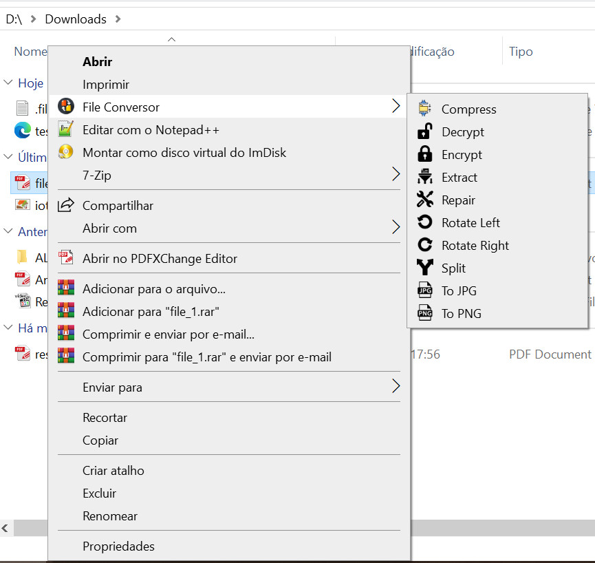

[](https://opensource.org/licenses/Apache-2.0)
[](https://sonarcloud.io/summary/new_code?id=andre-romano_file_conversor)
[](https://sonarcloud.io/summary/new_code?id=andre-romano_file_conversor)
[](https://sonarcloud.io/summary/new_code?id=andre-romano_file_conversor)
[](https://sonarcloud.io/summary/new_code?id=andre-romano_file_conversor)


# File Conversor
A powerful plugin-based CLI and GUI tool for converting, compressing, and manipulating audio, video, text, document, and image files.

**Summary**:
- [File Conversor](#file-conversor)
  - [Usage](#usage)
    - [CLI - Command line interface](#cli---command-line-interface)
    - [File Explorer Context Menu](#file-explorer-context-menu)
  - [Why use File Conversor?](#why-use-file-conversor)
  - [Features](#features)
  - [External dependencies](#external-dependencies)
    - [Automatic Dependency Installation](#automatic-dependency-installation)
  - [Installing](#installing)
    - [For Windows](#for-windows)
    - [For Linux / MacOS](#for-linux--macos)
  - [Contributing \& Support](#contributing--support)
  - [License and Copyright](#license-and-copyright)

## Usage

### CLI - Command line interface


Run ``file_conversor -h`` to explore all available commands and options.

### File Explorer Context Menu

1. Install File Conversor using the Installer (`.exe` - support for Linux and MacOS coming soon) 
2. Right click a file in Windows Explorer (support for other file managers is planned for future releases)
3. Choose an action from "File Conversor" menu
  


## Why use File Conversor?

- Automate repetitive file conversion or compression tasks
- Manipulate various media formats with a single tool
- Integrate seamlessly with scripting workflows
- Configure advanced file processing pipelines
- Parallelize tasks for massive multi-threaded processing

## Features

- **Format Conversion**
  - **Documents**: `docx ⇄ odt`, `docx → pdf`, etc
  - **Spreadsheets**: `xlsx ⇄ ods`, `xlsx → pdf`, etc
  - **Video**: `mkv ⇄ mp4`, `avi ⇄ mp4`, etc.
  - **Images**: `jpg ⇄ png`, `gif ⇄ webp`, `bmp ⇄ tiff`, etc.
  - **Audio**: `mp3 ⇄ m4a`, etc.
  - **Text**: `json ⇄ yaml`, `xml ⇄ json`, etc
  - And more ...

- **Compression**  
  - Optimizes size for formats like MP4, MP3, PDF, JPG, and others.

- **Metadata Inspection**  
  - Retrieves EXIF data from images, stream details from audio/video.

- **File Manipulation**  
  - **PDFs**: split, rotate, encrypt, etc  
  - **Images**: rotate, enhance, and apply other transformations  

- **Batch Processing**  
  - Use pipelines and config files for automation and advanced tasks.

- **Cross-Platform Compatibility**
  - Runs on Windows, Linux, and MacOS.

- **Multiple Interfaces**  
  - **Windows Explorer integration**: right-click files for quick actions
  - **CLI**: for scripting and automation  

*For full feature set, check* [`FEATURE_SET.md`](FEATURE_SET.md)

## External dependencies

- This software uses several third-party tools (such as FFmpeg, Calibre, LibreOffice, and others), via interprocess communication (i.e., processes, pipes, etc), to provide advanced features that are not feasible to implement internally (either due to complexity or licensing restrictions).
- These external tools are open-source projects, maintained independently from this software, and are **not bundled** with the distributed packages (`.exe`, `.deb`, `.rpm`, `.tar.gz`, etc). This approach helps:
  - reduce installer/package size;
  - avoid potential licensing and redistribution issues;
  - allow users to manage external dependencies independently.
- External dependencies are **not covered** by this software's license. All trademarks, copyrights, and licensing rights remain the property of their respective owners. Additional information is available in the [NOTICE](./NOTICE) file.

### Automatic Dependency Installation

- When a feature requires a missing external dependency, the software may prompt the user to install it automatically using supported user-level package managers (e.g., `brew`, `scoop`).
- **On Linux**:
  - Automatic dependency installation on Linux is currently **not supported** (and is unlikely to be supported in the future), primarily due to:
    1. Security and privilege concerns associated with system-wide package installation required by most Linux package managers (e.g., `apt`, `dnf`, `yum`, `pacman`, etc).
    2. Package naming and packaging inconsistencies across Linux distributions and package managers (e.g., `libreoffice-headless` vs. `libreoffice-nogui`).
    3. Differences in repository availability and package versions.
  - When a required dependency is missing on Linux, the software will instead prompt the user to install it manually.

## Installing

- Download the latest version of the app (check [Releases](https://github.com/andre-romano/file_conversor/releases/)) page.
- Follow the instructions below for your operating system and preferred installation method.

### For Windows

- **Option 1. Installer**:
  - Run the installer (`.exe` file) and follow the on-screen instructions.
  - This option **includes context menu** integration (right-click files for quick actions), if enabled during installation.
  - Portable version is also available (see Option 2 below).

- **Option 2. Portable Archive**:
  - Extract the ``.zip`` file.
  - Run the application.
  - This option DOES NOT include context menu integration (right-click files for quick actions).

- **Option 3. Scoop Package Manager**
  - This option allows you to install the app for the current user (**without administrator privileges**).
  - This option DOES NOT include context menu integration (right-click files for quick actions).
```bash
scoop install git
scoop bucket add file_conversor https://github.com/andre-romano/file_conversor_scoop_bucket
scoop install file_conversor
```

- **Option 4. Choco Package Manager**
  - This option **requires administrator privileges** and will install the app system-wide.
  - This option **will install context menu integration** (right-click files for quick actions) for all users on the system.
```bash
choco install file_conversor -y
```

### For Linux / MacOS

- **Option 1. Portable Archive**:
```bash
tar -xvaf file_conversor*.tar.gz
chmod +x file_conversor*
```

- **Option 2. Install .DEB or .RPM packages**
  - Download the latest version of the app (check [Releases](https://github.com/andre-romano/file_conversor/releases/)) page
  - For Debian-based distros:
    ```bash
    sudo dpkg -i file_conversor*.deb
    ```
  - For RPM-based distros:
    ```bash
    sudo rpm -i file_conversor*.rpm
    ```

- **Option 2. Docker**

```bash
docker run --rm -it -v $(pwd):/app andreromano/file_conversor:latest 
```

- **Option 3. Compile from Source**  
```bash
go install github.com/file-conversor/file_conversor@latest
```

## Contributing & Support

- **Support us**:
  - If you enjoy this project, consider supporting us with a donation in our Github Sponsors.
- **Acknowledgements**
  - We're grateful to the following contributors, whose work is featured in the app: [Freepik](https://www.flaticon.com/authors/freepik), [atomicicon](https://www.flaticon.com/authors/atomicicon), [swifticons](https://www.flaticon.com/authors/swifticons), [iconir](https://www.flaticon.com/authors/iconir), [iconjam](https://www.flaticon.com/authors/iconjam), [muhammad-andy](https://www.flaticon.com/authors/muhammad-andy), [Shuvo.Das](https://www.flaticon.com/authors/shuvodas), [Laisa Islam Ani](https://www.flaticon.com/authors/laisa-islam-ani), [riajulislam](https://www.flaticon.com/authors/riajulislam), [howcolour](https://www.flaticon.com/authors/howcolour) (via [Flaticon](https://www.flaticon.com))

## License and Copyright

Distributed under the **Apache License 2.0**.

By using this software, you agree to comply with the terms of the Apache License 2.0, as specified in the [`LICENSE`](./LICENSE) file. 

Further, you agree to respect the licenses of any third-party tools integrated or utilized by this software, as specified in the [`NOTICE`](./NOTICE) file. 

Please review software licenses to ensure compliance and avoid potential legal issues.
