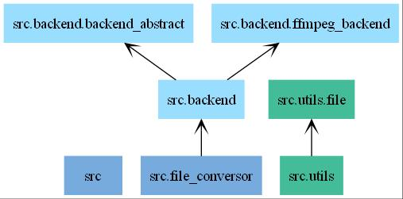
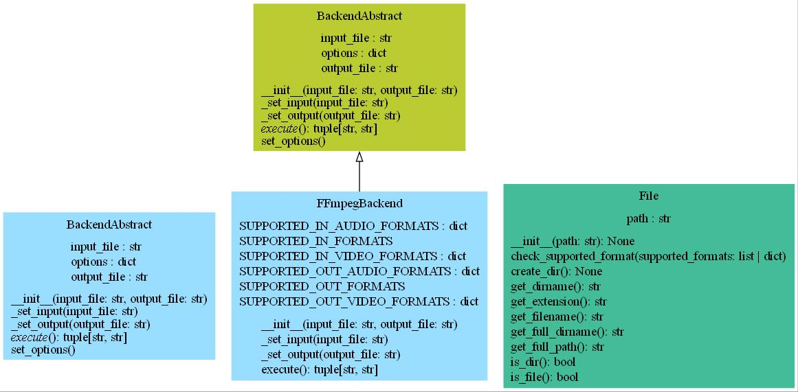
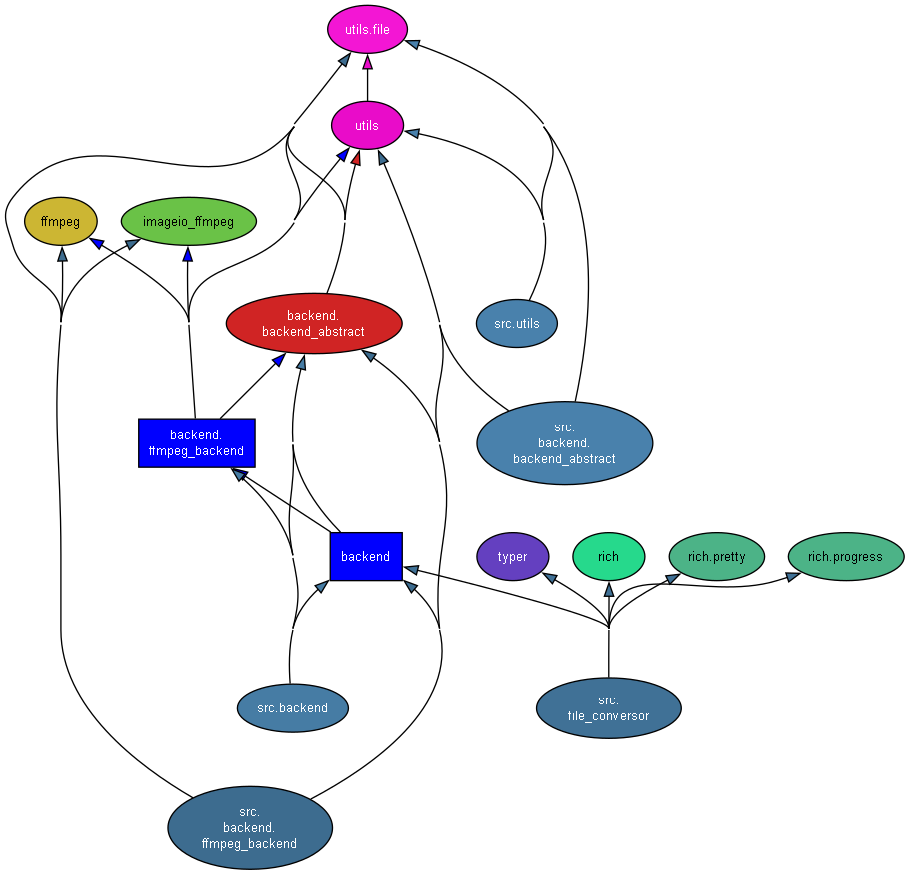

# UML diagrams

**Summary**:
- [UML diagrams](#uml-diagrams)
  - [Packages](#packages)
  - [Classes](#classes)
  - [Dependencies (imports)](#dependencies-imports)

## Packages
- Generated using ``pyreverse``

## Classes
- Generated using ``pyreverse``

## Dependencies (imports)
- Generated using ``pydeps``
  

